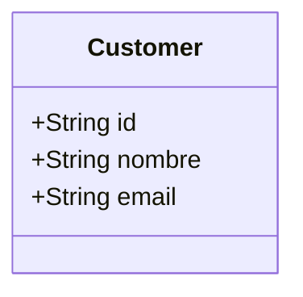

# Customer Search Feature
## Goal
Develop the search system for clients based on name or email criteria.
## Requirements Covered
- FR-01
- FR-02
- FR-03
- FR-04
- FR-05
- FR-06
- NFR-01
- NFR-02
- NFR-03
## Scope
Search for customers by name or email.
## Out of Scope
The development does not include the functionality to create, edit, or delete records.
## Domain Model

## Search Rules
Matches based on at least 3 consecutive characters. Results are sorted alphabetically by name or match, with higher priority given to matches on the name or email. If two items share the same match priority, alphabetical order is used.
## Validation Rules
N/A because the scope is limited to read-only access.
## Error Handling
If the search or the database fails, the exception must be caught. An internal failure returns a 500 response. If no reference is found, a 404 response is returned, indicating that no record was found for the search.
## Acceptance Criteria
AC-01 Given: customers with the names "Carlos Santana" and "Ana Martínez" exist in the database,
When: the user enters the search term "arl" or "CARLOS" and submits the query, Then: the system must return the record for "Carlos Santana" in the results list, confirming case-insensitivity and 
substring matching.
AC-02
Given: a customer named "José Gómez" exists in the database,
When: the user executes a search using plain text without accents "jose gomez",
Then: the system must return the record for "José Gómez" in the results list.
AC-04
Given: a customer with the email address "soporte.ti@empresa.com" exists in the database,
When: the user searches using the term "sop" or "emp" (at least 3 characters in matching order),
Then: the system must include this customer in the results list.
AC-05
Given: customers have database records containing id, full_name, email, password_hash, and tax_id,
When: an authenticated user executes a successful search,
Then: the HTTP response payload and displayed UI elements must only contain the authorized basic fields (id, full_name, 
email), and sensitive attributes (password_hash, tax_id) must be completely omitted from the payload received by the client.

AC-06
Given: three registered customers exist named "Ana" (exact match), "Anabel" (prefix match), and "Mariana" (substring 
match),
When: When the user searches for the term "Ana",
Then: Then the results must be returned and displayed in the following strict order of relevance: "Ana" "Anabel" "Mariana"
## Test Scenarios
Edge Cases:
- If the search field is empty, the interface must not execute unnecessary queries to the server.
- The system must apply a trim operation to remove whitespace from the beginning and end of the string. If the entered term consists exclusively of spaces, it must be treated as an empty query, and the request must be cancelled.
- The search must be completely case-insensitive. Querying "carlos", "Carlos", or "CARLOS" must return exactly the same set of results for both the name and the email address.
- The system must not overwhelm client memory or network bandwidth by attempting to send or render thousands of records simultaneously. Results should be delivered in segments, prioritizing the most relevant clients—based on the sorting algorithm—in the initial view.
Happy path:
- The system find a exaclty register.
## Constraints
No send all register. Only first 20 and pagination.
## Open Questions
N/A just reading register.
