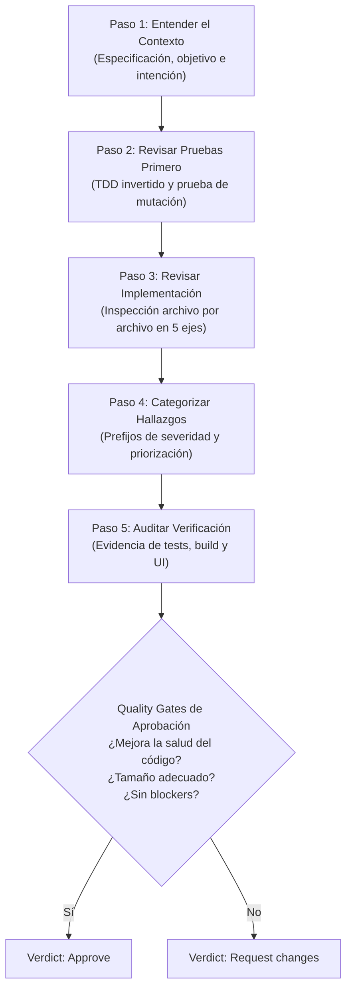
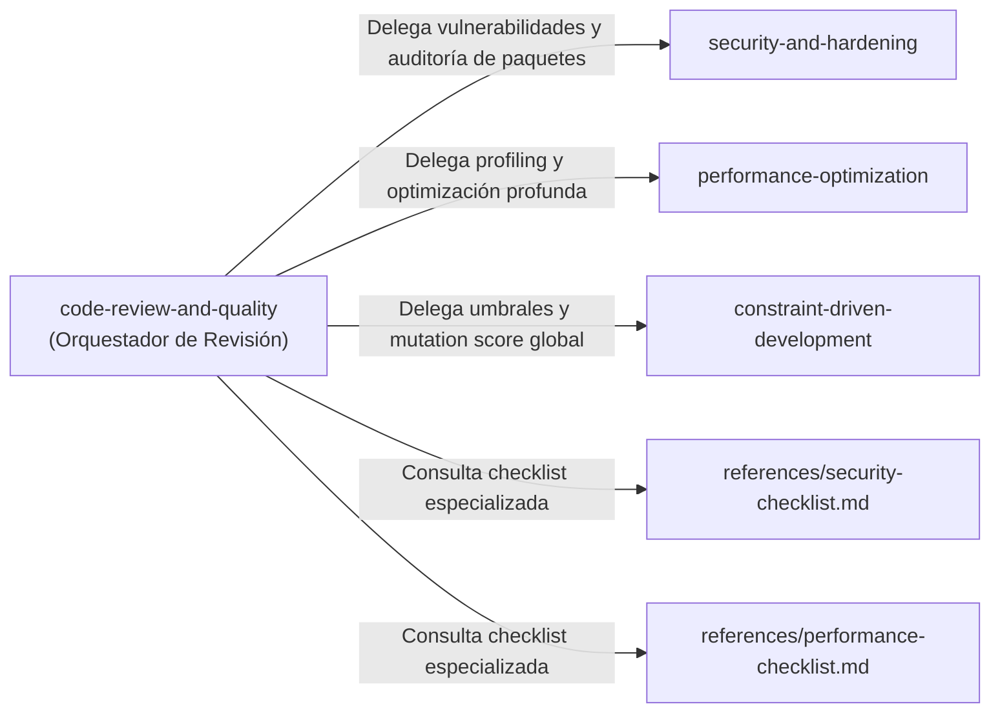

# Anatomía de una Skill Profesional: Análisis de Diseño de `code-review-and-quality`


## Tabla Resumen de Elementos de Diseño

| Elemento | Qué identifica la Skill                                                    | Análisis de Diseño e Implementación en `code-review-and-quality`                                                                                                                                                                                                         |
| :--- |:---------------------------------------------------------------------------|:-------------------------------------------------------------------------------------------------------------------------------------------------------------------------------------------------------------------------------------------------------------------------|
| **Routing** | Cómo la description identifica solicitudes de review de un diff/PR.        | Define disparadores semánticos amplios pero precisos en el frontmatter YAML, cubriendo revisiones previas al merge, inspección de código propio, de otros agentes o humanos, y variantes de entrada (pull requests o diffs pegados en línea).                            |
| **Workflow** | Pasos y quality gates antes del verdict.                                   | Estructura un proceso secuencial de 5 pasos (Contexto, Tests primero, Implementación, Categorización, Verificación de la verificación) con compuertas de tamaño, desacoplamiento de refactorización y estándar de salud incremental antes de emitir un veredicto formal. |
| **Review axes** | Correctness, readability/simplicity, architecture, security y performance. | Divide la evaluación en 5 dimensiones exhaustivas con preguntas heurísticas dirigidas, complementadas por un catálogo de "remedios estructurales" para proponer soluciones concretas en lugar de solo señalar síntomas.                                                  |
| **Severity** | Cómo diferencia blockers/required de feedback opcional.                    | Establece un sistema formal de prefijos (Critical:, sin prefijo/Required, Nit:, Optional:, FYI) con acciones mandatorias para el autor. Introduce el concepto de presumptive blockers para prevenir degradaciones de diseño sutiles.                                     |
| **Verification** | Qué evidencia exige antes de cerrar la revisión.                           | Exige evidencia empírica multifactorial: pruebas verdes antes y después, pruebas de mutación activa (invertir condiciones), build exitoso, capturas visuales para UI y auditoría estricta de lockfiles y changelogs en dependencias.                                     |
| **Composition** | Qué otras Skills o references recomienda.                                  | Modula la complejidad delegando temas profundos a Skills hermanas (security-and-hardening, performance-optimization, constraint-driven-development), checklists externas y patrones multi-modelo (Model A programa, Model B revisa, Humano decide).                      |
| **Boundaries** | Qué decisiones deja al humano y qué acciones no ejecuta silenciosamente.   | Otorga la decisión final de merge al humano, prohíbe terminantemente la eliminación silenciosa de código muerto (obliga a preguntar), prohíbe editar lockfiles a mano, prohíbe el rubber-stamping y fija una jerarquía técnica para resolver desacuerdos.                |

---

## Análisis Detallado del Diseño

### 1. Routing (Enrutamiento y Activación Semántica)

El frontmatter YAML de la Skill define su disparador de la siguiente forma:

```yaml
---
name: code-review-and-quality
description: Conducts multi-axis code review. Use before merging any change. Use when reviewing code written by yourself, another agent, or a human. Use when you need to assess code quality across multiple dimensions before it enters the main branch. Use when asked to review a diff or a pull request, even when the diff is pasted inline.
---
```

#### Aspectos Clave de su Diseño:
- **Agnóstica del Autor:** Reconoce explícitamente tres orígenes del código: código escrito por el propio agente evaluador (*self-review*), código generado por otro agente/modelo, o código escrito por un humano. Esto neutraliza sesgos cognitivos o asunciones de infalibilidad.
- **Momento del Ciclo de Vida:** Posiciona la herramienta como compuerta previa al merge (*"Use before merging any change"*, *"before it enters the main branch"*), evitando que se active innecesariamente durante fases exploratorias de prototipado.
- **Polimorfismo de Entradas:** Contempla explícitamente tanto revisiones formales de repositorios/PRs como diffs crudos suministrados directamente en la ventana de chat (*"even when the diff is pasted inline"*), asegurando que el LLM no falle al enrutar cuando el usuario no provee una URL de GitHub.

---

### 2. Workflow (Flujo de Trabajo y Quality Gates)

La Skill no salta directamente a comentar líneas de código; descompone la revisión en un procedimiento disciplinado de cinco fases antes de llegar al veredicto:



#### Fases del Workflow:
1. **Paso 1 (Contexto):** Exige comprender qué busca resolver el cambio y qué especificación normativa satisface antes de juzgar la implementación.
2. **Paso 2 (Revisar los tests primero):** Aplica el principio de *Test-First Review*. Los tests revelan el comportamiento esperado y las condiciones de borde. Si no hay tests o no prueban comportamiento real, la revisión de la implementación carece de base.
3. **Paso 3 (Revisión de implementación):** Recorrido metódico archivo por archivo evaluando los 5 ejes.
4. **Paso 4 (Categorización de hallazgos):** Clasificación estricta de comentarios por severidad y ordenamiento por palanca de impacto (*high leverage*).
5. **Paso 5 (Verificar la verificación):** Comprobación de la evidencia provista por el autor.

#### Quality Gates Intermedios:
- **Compuerta de Tamaño del Cambio (*Change Sizing*):** Establece umbrales numéricos claros:
  - $\sim 100$ líneas: Óptimo para revisión de una sola pasada.
  - $\sim 300$ líneas: Aceptable solo si es un único cambio lógico cohesivo.
  - $\sim 1000$ líneas: Demasiado grande; se exige dividir el cambio (*Stack, By file group, Horizontal, Vertical*).
  - Alerta sobre el tamaño del archivo: Archivos que superan $\sim 1000$ líneas totales requieren descomposición antes de recibir nuevo código.
- **Compuerta de Desacoplamiento:** Prohíbe mezclar refactorizaciones con nuevas funcionalidades (*feature work*); deben enviarse en cambios separados.
- **Estándar de Aprobación Realista:** La regla rectora es: *"Aprobar cuando mejore definitivamente la salud general del código, incluso si no es perfecto"*. Evita el perfeccionismo paralizante y los bloqueos por preferencias de estilo personal.

---

### 3. Review Axes (Los Cinco Ejes de Revisión y Remedios)

La Skill estructura la evaluación técnica sobre cinco pilares ortogonales, evitando que el revisor se concentre únicamente en si la sintaxis compila:

#### 1. Correctness (Corrección Funcional)
- ¿Cumple la especificación o requerimiento formal?
- Manejo de valores de borde (nulos, vacíos, límites numéricos).
- Rutas de error controladas frente a casos de falla.
- Detección de *off-by-one errors*, condiciones de carrera e inconsistencias de estado.

#### 2. Readability & Simplicity (Legibilidad y Simplicidad)
- Nombres descriptivos y consistentes (prohibición de identificadores vagos como `temp`, `data`, `result`).
- Flujo de control plano (evitar ternarios anidados y callbacks profundos).
- Economía de código: evaluar si el cambio pudo implementarse en menos líneas (*"1000 líneas donde 100 bastan es un fracaso"*).
- Regla de abstracciones: no generalizar hasta el tercer caso de uso real.
- Detección de "olores" de diseño: condicionales añadidos a la fuerza (*bolted-on*) sobre flujos no relacionados.

#### 3. Architecture (Arquitectura y Cohesión)
- Respeto a las capas del sistema y dirección de dependencias (cero dependencias circulares).
- Reducción real de complejidad vs. reubicación de complejidad: evaluar si un refactor realmente reduce los conceptos mentales que el lector debe retener.
- Fugas de abstracción: evitar que lógica específica de una funcionalidad contamine módulos generales o compartidos.
- Fronteras de tipos explícitas: cuestionar el uso gratuito de `any`/`unknown` y caídas silenciosas (*silent fallbacks*).

#### 4. Security (Seguridad)
- Validación y sanitización estricta en las fronteras de entrada (*boundary validation*).
- Cero secretos o credenciales en código, logs o commits.
- Consultas parametrizadas (prevención de SQLi) y codificación de salida (anti-XSS).
- Principio de desconfianza: datos externos (APIs, archivos, logs) tratados siempre como no confiables.

#### 5. Performance (Rendimiento)
- Detección de patrones N+1 en bases de datos o red.
- Bucles no acotados y peticiones sin límite de tamaño.
- Operaciones bloqueantes que deban ser asíncronas.
- Paginación obligatoria en endpoints de colecciones y evitación de renders innecesarios.

#### Remedios Estructurales Nombrados (*Structural Remedies*):
Un rasgo sobresaliente del diseño es que exige al revisor proponer el "movimiento" arquitectónico exacto, no solo quejarse de la complejidad:
- Reemplazar cadenas condicionales por modelos tipados o *dispatchers*.
- Separar orquestación de lógica de negocio.
- Eliminar envoltorios pasantes (*pass-through wrappers*) que agregan indirección sin claridad.
- Reutilizar el helper canónico existente en lugar de crear un duplicado local.

---

### 4. Severity (Taxonomía de Severidad y Priorización)

Para evitar la fricción en la que los autores pierden tiempo atendiendo detalles cosméticos mientras descuidan fallos críticos, la Skill prescribe una nomenclatura precisa para cada comentario:

| Prefijo | Significado | Acción Requerida del Autor | Criterio de Bloqueo |
| :--- | :--- | :--- | :--- |
| **`Critical:`** | Bloqueante absoluto | Debe resolverse antes del merge sin excepción | Vulnerabilidad de seguridad, pérdida de datos, funcionalidad rota |
| *(sin prefijo)* / **Required** | Cambio requerido | Debe corregirse o justificarse formalmente | Desvío de requerimiento, falta de tests, violación arquitectónica |
| **`Nit:`** | Detalle menor | Opcional; el autor puede ignorarlo | Preferencias de formato menor, estilo no regulado por linter |
| **`Optional:`** / **`Consider:`** | Sugerencia técnica | Recomendación a criterio del autor | Ideas de diseño alternativas que no comprometen la salud actual |
| **`FYI:`** | Informativo | No requiere ninguna acción | Contexto didáctico, notas para futuras iteraciones |

#### Concepto de *Presumptive Blockers*:
La Skill define situaciones arquitectónicas que deben señalarse de inmediato con un diseño simplificado alternativo, escalando a *Required* si empeoran activamente la estructura:
- Refactorizaciones que solo mueven complejidad de lugar.
- Cambios que empujan un archivo más allá de límites saludables sin descomponerlo.
- Lógica de caso de uso inyectada en módulos compartidos.
- Helpers redundantes que duplican utilidades canónicas existentes.

#### Principio de Priorización (*Lead with what matters*):
Exige ordenar las observaciones por palanca: primero corrección y seguridad, luego regresiones estructurales, y al final detalles cosméticos. Si hay un problema estructural grave y diez nits, el problema estructural *es* la revisión y no debe diluirse.

---

### 5. Verification (Evidencia Exigida antes de Cerrar)

La Skill rechaza la complacencia de aprobar sobre promesas o lecturas pasivas (*"The tests pass, so it's good"* es catalogado como una racionalización errónea). Exige las siguientes evidencias comprobables:

1. **Prueba de Mutación Experimental en Revisión:**
   - La Skill instruye probar activamente la solidez de los tests invirtiendo una condición (eliminar una negación, cambiar `&&` por `||`), correr la suite y confirmar que falle. Si la suite permanece en verde ante una mutación, se documenta como un hallazgo crítico: falta un caso de prueba.
2. **Ejecución y Estado de la Suite:**
   - Confirmación de suite de tests en verde tanto antes como después del cambio.
   - Éxito verificado de la compilación/build sin advertencias pasadas por alto.
3. **Evidencia Visual y Empírica:**
   - Pruebas manuales documentadas cuando aplique.
   - Capturas de pantalla con comparativas antes/después para alteraciones de interfaz gráfica.
4. **Disciplina de Dependencias (*Dependency Discipline*):**
   - Prohibición de revisiones en bulto (*bulk dependency bumps*): un paquete por cambio para mantener reversiones atómicas.
   - Lectura obligatoria del changelog de la librería (semver no garantiza ausencia de cambios de conducta).
   - Auditoría obligatoria del diff del archivo de bloqueo (*lockfile*), prohibiendo modificaciones manuales en él.

---

### 6. Composition (Composición y Relación con el Ecosistema)

La Skill no intenta resolver todos los dominios de la ingeniería en un único archivo monolítico; aplica el principio de responsabilidad única mediante composición horizontal y vertical:



#### Enlaces de Composición:
- **`security-and-hardening`:** Invocada para auditoría de vulnerabilidades complejas (`npm audit`), amenazas en la cadena de suministro (*typosquatting*) y modelado formal de amenazas.
- **`performance-optimization`:** Invocada cuando se identifican cuellos de botella que requieren profiling detallado, benchmarks o ajuste de memoria.
- **`constraint-driven-development`:** Invocada para la gestión de contratos de calidad y puntuaciones globales de mutación del proyecto.
- **Patrón de Revisión Multi-Modelo (*Multi-Model Review Pattern*):**
  - Reconoce que un solo modelo tiene puntos ciegos.
  - Orquesta un flujo colaborativo: *Modelo A* implementa código $\rightarrow$ *Modelo B* revisa corrección y arquitectura $\rightarrow$ *Modelo A* atiende comentarios $\rightarrow$ *Humano* toma la decisión final.

---

### 7. Boundaries (Límites de Seguridad y Autonomía)

Una característica distintiva de una Skill profesional frente a un script descontrolado es la delimitación explícita de lo que el agente **nunca debe hacer sin supervisión humana**:

#### 1. El Humano Mantiene el Arbitraje Final (*Human-in-the-Loop*)
- El agente diagnostica, categoriza y emite una recomendación fundada (*Approve* o *Request changes*), pero la decisión definitiva de incorporar el código a la rama protegida recae en el ingeniero humano responsable.
- Aceptación elegante de revocaciones (*Accept override gracefully*): si el autor humano comprende el contexto completo y discrepa con el agente, el agente debe respetar la decisión sin insistencias repetitivas o tercas.

#### 2. Prohibición de Modificaciones y Eliminaciones Silenciosas
- **Higiene de Código Muerto (*Dead Code Hygiene*):** Al detectar código que quedó inalcanzable tras una refactorización, el agente tiene prohibido borrarlo silenciosamente. La Skill instruye listar el código muerto explícitamente y solicitar confirmación previa:
  > *"DEAD CODE IDENTIFIED: [lista] $\rightarrow$ ¿Es seguro remover estos elementos?"*
- **Intangibilidad Manual de Lockfiles:** El agente tiene prohibido alterar a mano los archivos de bloqueo de dependencias (`package-lock.json`, `poetry.lock`, etc.); estos deben derivarse únicamente de los gestores oficiales.

#### 3. Honestidad Intelectual y Anti-Siconfancia (*Anti-Sycophancy*)
- Prohíbe terminantemente el *rubber-stamping*: emitir aprobaciones tipo "LGTM" sin evidencia sustancial de inspección es una falla grave.
- Prohíbe suavizar defectos críticos: maquillar un bug peligroso como "una observación menor" para complacer al autor es considerado deshonesto por la Skill.
- Rechazo tajante a la deuda técnica diferida: no acepta promesas del tipo *"lo arreglaremos después"*, salvo emergencias comprobadas con un issue asignado.

#### 4. Jerarquía Objetiva para Disputas Técnicas
Cuando surge un desacuerdo en la revisión, la Skill prohíbe discusiones subjetivas o sobre preferencias de autor, sometiendo el análisis a una jerarquía estricta:
1. Los **datos y hechos técnicos verificables** superan opiniones y preferencias.
2. Las **guías de estilo del proyecto** son la autoridad absoluta en asuntos de formato.
3. El **diseño de software** debe evaluarse contra principios de ingeniería probados.
4. La **consistencia del código base** es válida siempre que no degrade la salud general.

---

## Conclusiones sobre la Calidad de Diseño de la Skill

La Skill [`code-review-and-quality`](file:///D:/IGNITER/Documents/Proyectos/ADA-05-SPEC-DRIVEN/.agents/skills/code-review-and-quality/SKILL.md) destaca como un estándar de excelencia en la ingeniería de agentes autónomos debido a tres principios clave:

1. **Orientación a la Acción Constructiva:** No es un mero detector pasivo de errores; obliga a ofrecer remedios arquitectónicos concretos y a clasificar la severidad para proteger el tiempo del equipo.
2. **Defensa Activa de la Evidencia:** Transforma la revisión de código de una lectura pasiva a una auditoría activa mediante técnicas como la prueba de mutación deliberada y la verificación estricta de suites y lockfiles.
3. **Gobierno y Seguridad Ética:** Establece salvaguardas claras que previenen la destrucción involuntaria de código, evitan la adulación algorítmica y preservan la autoridad y el juicio crítico del desarrollador humano.
