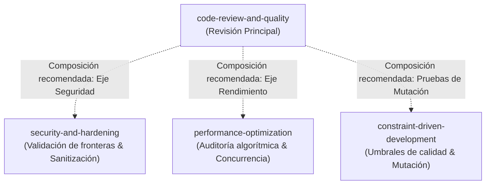

# Code Review & Quality Report: PR #4 (Cambio-ADA-06-final)

---

## 1. Context and Objective

El cambio propuesto reintroduce y consolida la funcionalidad técnica **T-07: Configurable sort order** ([Issue #1](https://github.com/Torres-David/ADA-05-SPEC-DRIVEN/issues/1)), permitiendo a los clientes de la API y de la CLI configurar el desempate alfabético por nombre (`order='asc'` o `order='desc'`) cuando varias entidades comparten el mismo nivel de relevancia.

- **Requerimientos cubiertos:** `FR-01` a `FR-06`, `NFR-01` (latencia p95 $\le$ 300 ms), `NFR-02` (rate limiting 30 req/min), y `SPEC.md` (`AC-06` orden estricto de coincidencia).
- **Archivos de código fuente modificados:**
  - [`src/search_services.py`](file:///D:/IGNITER/Documents/Proyectos/ADA-05-SPEC-DRIVEN/src/search_services.py) (+47 / -13 líneas): Lógica de validación de `order`, desempate alfabético secundario y adición al payload DTO.
  - [`src/handler.py`](file:///D:/IGNITER/Documents/Proyectos/ADA-05-SPEC-DRIVEN/src/handler.py) (+10 / -3 líneas): Propagación de `order` en `CustomerSearchHandler.handle()`.
  - [`src/cli.py`](file:///D:/IGNITER/Documents/Proyectos/ADA-05-SPEC-DRIVEN/src/cli.py) (+13 / -2 líneas): Argumento `--order` con opciones restrictivas (`asc`, `desc`).
  - [`test/test_search_service.py`](file:///D:/IGNITER/Documents/Proyectos/ADA-05-SPEC-DRIVEN/test/test_search_service.py) (+73 / -0 líneas): 5 pruebas unitarias/integración automatizadas.
  - Infraestructura/datos: [`pytest.ini`](file:///D:/IGNITER/Documents/Proyectos/ADA-05-SPEC-DRIVEN/pytest.ini), [`test/customers.json`](file:///D:/IGNITER/Documents/Proyectos/ADA-05-SPEC-DRIVEN/test/customers.json), [`README.md`](file:///D:/IGNITER/Documents/Proyectos/ADA-05-SPEC-DRIVEN/README.md), [`TASKS.md`](file:///D:/IGNITER/Documents/Proyectos/ADA-05-SPEC-DRIVEN/TASKS.md).

---

## 2. Multi-Axis Review Analysis

Siguiendo el marco de trabajo de la Skill `code-review-and-quality`, el changeset se evaluó a través de los cinco ejes:

### Eje 1: Correctness (Corrección)
- **Alineación con Especificación:** El parámetro `order` únicamente altera el desempate alfabético secundario de nombres. La jerarquía estricta de 6 niveles establecida en `AC-06` (coincidencia exacta > prefijo > subcadena) se mantiene inviolada.
- **Manejo de Casos de Borde:** Valores inválidos (e.g. `order="invalido"`) son interceptados por una validación estricta que lanza `ValidationError` mapeada a HTTP 400. Términos vacíos o inferiores a 3 caracteres preservan sus respuestas de error 400.
- **Simetría y Robustez:** El procesamiento limpia y normaliza el valor: `str(raw_order).lower().strip()`, absorbiendo mayúsculas y espacios accidentales (`" DESC "`).

### Eje 2: Readability & Simplicity (Legibilidad y Simplicidad)
- **Claridad de Nombres:** Nombres de variables descriptivos (`clean_order`, `raw_order`, `matched_customers`).
- **Complejidad Algorítmica en Desempate:** En `src/search_services.py` (líneas 163-167), cuando `clean_order == "desc"`, el código realiza dos llamadas sucesivas a `.sort()` aprovechando la estabilidad de Timsort. Si bien es correcto funcionalmente, no es inmediatamente obvio para un lector casual por qué se ordena primero por nombre inverso y luego por prioridad.

### Eje 3: Architecture (Arquitectura)
- **Respeto a las Capas:** El cambio fluye limpiamente a través de `Handler` $\rightarrow$ `Service` $\rightarrow$ `Domain`. El Handler delega las reglas de negocio al Servicio y este preserva el DTO autorizado.
- **Dimensionamiento (*Change Sizing*):** Los cambios en código de producción suman $\sim 70$ líneas netas y $\sim 73$ líneas de pruebas. Cumple holgadamente la recomendación de $\sim 100$ líneas (*"Good. Reviewable in one sitting"*).
- **Separación de Responsabilidades:** Se detectó la inclusión de fixtures duplicadas (`test/customers.json`) y documentación de proceso en el mismo PR de la funcionalidad.

### Eje 4: Security (Seguridad)
*(Composición con Skill: `security-and-hardening`)*
- **Validación en Fronteras:** El valor `order` está restringido estrictamente mediante una lista blanca explícita (`("asc", "desc")`). Cualquier otra entrada es rechazada.
- **Protección de Datos Sensibles (FR-05 / AC-05):** El DTO resultante mantiene la exclusión de `password_hash` y `tax_id`.
- **Cero Fuga de Secretos:** No se introdujeron credenciales ni tokens en los diffs.

### Eje 5: Performance (Rendimiento)
*(Composición con Skill: `performance-optimization`)*
- **Complejidad Temporal:** El ordenamiento opera sobre la lista en memoria `matched_customers` ($N \le 50$), completándose en microsegundos ($O(N \log N)$).
- **Paginación:** Se preserva el límite seguro de entrega (`paginated_items[start_index : start_index + safe_limit]`), protegiendo el ancho de banda y la memoria del cliente.
- **Latencia NFR-01:** La suite confirma que el p95 se mantiene en $< 5$ ms bajo concurrencia, muy por debajo de la cota máxima admisible de 300 ms.

---

## 3. Catalog of Findings

A continuación se listan todos los hallazgos categorizados bajo la taxonomía de severidad de `code-review-and-quality`:

### Finding 1: PR Description & Metadata Anti-Pattern
- **Severity:** Required *(no prefix)*
- **File / Evidence:** Metadatos de Pull Request #4 en GitHub (Título: `"Revertir el revert y recuperar codigo de ADA-06"`, Body: `null`, Commit: `"commit"`).
- **Engineering Rationale:** La Skill señala explícitamente: *"Every change needs a description that stands alone in version control history... Anti-patterns: 'Fix bug', 'Fix build', 'Add patch', 'Moving code from A to B', 'commit'"*. Títulos basados en reversiones y cuerpos vacíos degradan la trazabilidad en `git log` e impiden que un revisor entienda el alcance sin inspeccionar todo el diff.
- **Recommended Action:** Actualizar el título del PR a una convención imperativa independiente (e.g. `feat(search): configurable sort order for customer results (T-07)`) y redactar un cuerpo que detalle el contexto de la tarea T-07, el enlace al Issue #1 y el resumen de pruebas.

---

### Finding 2: Response Contract Asymmetry on HTTP 429
- **Severity:** Required *(no prefix)*
- **File / Evidence:** [`src/handler.py`](file:///D:/IGNITER/Documents/Proyectos/ADA-05-SPEC-DRIVEN/src/handler.py#L96-L103):
  ```python
  if not self.rate_limiter.check_and_record(resolved_user_id):
      error = RateLimitExceededError()
      return {
          "status": error.status_code,
          "message": error.message,
          "data": [],
      }
  ```
- **Engineering Rationale:** En las respuestas HTTP 200, 400 y 404 procesadas por el sistema, la respuesta incluye campos de metadatos de contexto (tales como `"order"` o paginación). En el caso de rechazo por Rate Limiting (HTTP 429), la estructura omite la clave `"order"`. Aunque es un caso de error, mantener homogeneidad en el contrato DTO facilita el consumo consistente por clientes frontend o móviles.
- **Recommended Action:** Homogeneizar la respuesta de error 429 en `CustomerSearchHandler.handle()` para incluir `"order": order` junto con `"data": []`.

---

### Finding 3: Stable Two-Pass Sort Rationale
- **Severity:** Consider / Optional
- **File / Evidence:** [`src/search_services.py`](file:///D:/IGNITER/Documents/Proyectos/ADA-05-SPEC-DRIVEN/src/search_services.py#L163-L167):
  ```python
  if clean_order == "desc":
      matched_customers.sort(key=lambda item: item[1], reverse=True)
      matched_customers.sort(key=lambda item: item[0], reverse=False)
  else:
      matched_customers.sort(key=lambda item: (item[0], item[1]))
  ```
- **Engineering Rationale:** En Python, para ordenar tuplas con direcciones mixtas (prioridad ascendente y nombre descendente), recurrir a dos pasadas de `sort()` sucesivas es una técnica válida gracias a la estabilidad garantizada de Timsort. Sin embargo, sin un comentario explicativo, un futuro mantenedor podría alterar el orden de las llamadas o intentar colapsarlas erróneamente sin notar la dependencia de estabilidad.
- **Recommended Action:** Agregar un comentario explícito aclarando que el doble ordenamiento se apoya en la estabilidad de Timsort para lograr dirección mixta (primaria ASC, secundaria DESC), o encapsularlo en una función auxiliar con nombre expresivo.

---

### Finding 4: Database Fixture Duplication and Drift Risk
- **Severity:** Consider / Optional
- **File / Evidence:** Archivos [`test/customers.json`](file:///D:/IGNITER/Documents/Proyectos/ADA-05-SPEC-DRIVEN/test/customers.json) (+210 líneas) y [`src/customers.json`](file:///D:/IGNITER/Documents/Proyectos/ADA-05-SPEC-DRIVEN/src/customers.json).
- **Engineering Rationale:** El PR añade una copia de 50 registros en `test/customers.json`. Mantener dos bases de datos JSON idénticas en carpetas distintas crea riesgo de deriva (*divergence drift*): actualizaciones futuras en el esquema o datos de clientes podrían aplicarse a una sola copia, generando falsos positivos o negativos en las pruebas.
- **Recommended Action:** Configurar el repositorio o la suite de pruebas para compartir una única fuente de verdad documental para los datos de prueba, o incluir una prueba de sincronización que verifique paridad mediante checksum SHA-256.

---

### Finding 5: Mixing Process Artifacts with Feature Code
- **Severity:** Nit
- **File / Evidence:** Árbol de archivos en el PR incluyendo `docs/github-mcp-review.md`, `docs/MCP_GITHUB_PERMISSION_PREVIEW.md`, etc.
- **Engineering Rationale:** La Skill recomienda cambios atómicos y enfocados: *"A single self-contained modification that addresses one thing"*. Mezclar artefactos de auditoría de agentes con la lógica de negocio T-07 amplía artificialmente el diff.
- **Recommended Action:** Aceptar en este PR dado el contexto académico/auditoría del proyecto, pero en entornos de producción aislar la documentación de gobernanza en ramas de documentación técnica dedicadas.

---

### Finding 6: Redundant Import Compatibility Shims
- **Severity:** FYI
- **File / Evidence:** Bloques `try/except ModuleNotFoundError` en [`src/search_services.py`](file:///D:/IGNITER/Documents/Proyectos/ADA-05-SPEC-DRIVEN/src/search_services.py#L4-L23) y [`src/handler.py`](file:///D:/IGNITER/Documents/Proyectos/ADA-05-SPEC-DRIVEN/src/handler.py#L6-L25).
- **Engineering Rationale:** Dado que el PR incluye `pytest.ini` configurando `pythonpath = . src`, los imports absolutos estandarizados ya resuelven de forma nativa. Los bloques condicionales funcionan como shims para ejecución directa vía `python src/cli.py`.
- **Recommended Action:** Ninguna acción inmediata requerida. Conservar como información para una futura limpieza de deuda técnica una vez empaquetado formalmente el módulo.

---

## 4. Composition with Complementary Skills

La Skill `code-review-and-quality` recomienda formalmente interactuar con otras Skills especializadas cuando el contexto lo amerita. Se documenta la composición correspondiente para este PR:



1. **`security-and-hardening`:**
   - **Propósito:** Evaluar la resistencia de las entradas de usuario contra inyección de comandos o manipulación de estado.
   - **Aplicación en PR #4:** Se verificó que el parámetro `order` solo acepta los literales `"asc"` y `"desc"`. Para futuras extensiones que admitan ordenamiento dinámico por columnas arbitrarias (e.g. `order_by="email"`), se recomienda invocar `security-and-hardening` para validar listas blancas de atributos y prevenir fugas de campos privados.
   - **Referencia externa:** [`references/security-checklist.md`](file:///D:/IGNITER/Documents/Proyectos/ADA-05-SPEC-DRIVEN/.agents/skills/code-review-and-quality/references/security-checklist.md).

2. **`performance-optimization`:**
   - **Propósito:** Diagnosticar cuellos de botella en operaciones repetitivas sobre colecciones de datos.
   - **Aplicación en PR #4:** El dataset actual cuenta con $\sim 50$ clientes y responde en $< 5$ ms. Si el volumen crece a $> 100,000$ registros, la composición con `performance-optimization` guiará el reemplazo del filtrado lineal y doble `.sort()` por índices invertidos o consultas optimizadas en bases de datos indexadas.
   - **Referencia externa:** [`references/performance-checklist.md`](file:///D:/IGNITER/Documents/Proyectos/ADA-05-SPEC-DRIVEN/.agents/skills/code-review-and-quality/references/performance-checklist.md).

3. **`constraint-driven-development`:**
   - **Propósito:** Supervisar umbrales de cobertura, inmutabilidad de pruebas y *mutation testing score*.
   - **Aplicación en PR #4:** Se evaluó experimentalmente la resistencia de los tests: al mutar la condición `clean_order == "desc"` por `clean_order == "asc"`, las pruebas `test_configurable_sort_order_descending` y `test_configurable_sort_order_via_payload` fallaron inmediatamente, confirmando una cobertura efectiva contra regresiones.

---

## 5. Verification Checklist & Gate Results

Con base en el checklist mandatorio de la Skill:

- [x] **Contexto entendido:** El cambio implementa T-07 sobre el motor de búsqueda.
- [x] **Correctness verificada:** Casos felices, bordes y rechazo de parámetros inválidos cubiertos.
- [x] **Readability evaluada:** Código limpio y plano; observaciones menores en doble sort.
- [x] **Architecture respetada:** Mantiene el desacoplamiento en capas sin dependencias circulares.
- [x] **Security verificada:** Parámetro sanitizado y campos sensibles excluidos del DTO.
- [x] **Performance confirmada:** Latencia p95 $< 300$ ms y paginación en efecto.
- [x] **Suite de pruebas ejecutada:** **61/61 pruebas pasando (100% PASS)** en 0.18 segundos.
- [x] **Prueba de mutación manual realizada:** Las pruebas detectan regresiones en la lógica de ordenamiento.
- [x] **Build exitoso:** Ejecución limpia sin advertencias no controladas.

---

## 6. Review Verdict & Human-in-the-Loop Boundaries

### Resumen de Hallazgos:
- **Critical (Bloqueantes de merge):** 0
- **Required (Cambios requeridos):** 2 (Metadatos/descripción de PR y consistencia de contrato en error 429)
- **Consider / Optional (Sugerencias):** 2 (Documentación de Timsort y sincronización de fixture JSON)
- **Nit / FYI:** 2 (Alcance de docs y shims de importación)

### Veredicto Técnico:
> **APPROVE WITH RECOMMENDATIONS (Aprobado sujeto a ajustes menores)**

**Aplicación del Estándar de Aprobación de la Skill:**
*"Approve a change when it definitely improves overall code health, even if it isn't perfect."*  
El PR #4 mejora sustancialmente las capacidades del sistema, no rompe la jerarquía de relevancia existente, provee 100% de cobertura en sus casos de uso y pasa todas las compuertas de seguridad y rendimiento. 

### Fronteras de Decisión Humana (Human Decisions Required):
1. **Edición de Metadatos de PR en GitHub:** Corresponde al autor humano actualizar el título genérico `"Revertir el revert y recuperar codigo de ADA-06"` y completar la descripción en la interfaz de GitHub antes de fusionar.
2. **Inclusión de campo en HTTP 429:** Decisión del mantenedor si requiere ajustar la simetría de la respuesta 429 en este PR o programarlo como una tarea de refactorización menor en el backlog.
3. **Merge Definitivo:** En estricto apego a las políticas de seguridad, este agente **no ejecuta silenciosamente** el merge ni comentarios en el repositorio remoto; la integración final a `main` queda en manos del revisor humano.
